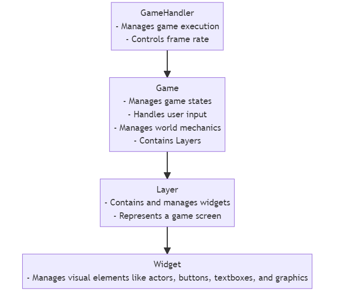
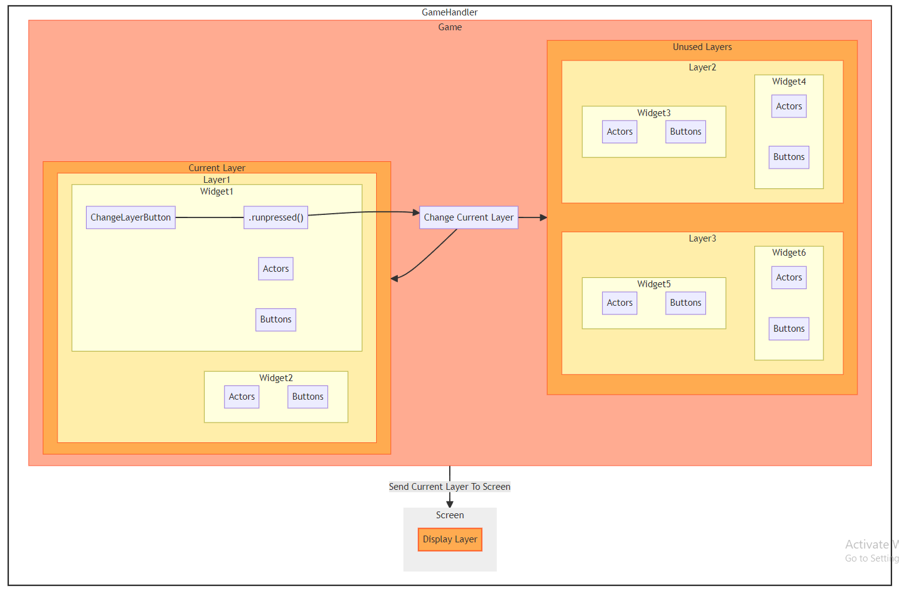

# PyGame_ClassExt_smongan1 Package

This package provides a collection of utility classes and functions designed to enhance game development using the Pygame library. It offers a variety of features to streamline the creation of interactive and animated game elements, manage inventories, implement physics, and more.
  
## Flowchart Diagram

## Containerized Diagram

<b>GameHandler</b>: The core element managing game functionality. It comprises two main parts: "Screen" and "Game."

<b>Screen</b>: Represents the visible game interface for players. It contains a "Display Layer" where visual elements are presented.

<b>Game</b>: Responsible for game logic. Interacts with the "Current Layer" and includes a connection to "Change Current Layer."

<b>Current Layer</b>: The currently active game layer displayed on the screen. It encompasses elements like "Widget1," "Widget2," and so on.

<b>Widget1</b>: Contains in-game entities and interactive elements (like <b>Buttons</b> and <b>Actors</b> aka characters).

<b>Widget2</b>: Similar to Widget1, also containing game entities and interactive elements.

<b>Unused Layers</b>: Inactive layers, such as "Layer2" and "Layer3."

<b>Layer2</b>: Similar to the active layers, holding "Widget3" and "Widget4."

<b>Layer3</b>: Also similar to the active layers, housing "Widget5" and "Widget6."

<b>ChangeLayerButton</b>: Transitions active layer when pressed.

The directional arrows in the diagram represent interactions:

The arrow "Send Current Layer To Screen" indicates that the content of the Current Layer is displayed on the Screen.

In summary, the diagram visually outlines the relationships between different components within the game framework.

## BaseClasses.py

Description: This module provides a versatile framework for developing 2D games using the Pygame library. The framework includes a set of classes and functionalities designed to streamline various aspects of game development, such as managing graphical elements, interactive widgets, user input, and more.

### Features:

Easily create and manage game layers, widgets, actors, buttons, textboxes, and graphics.<\p>

Automate component removal with the Deleteable class.

Handle user input, mouse events, and keyboard input seamlessly.

Implement interactive elements with customizable appearance and behavior.

Develop complex game logic, movement, and physics for actors.

Create dynamic user interfaces with buttons and textboxes for user interaction.

## utilities.py
Description: This module contains a collection of utility functions for various tasks involving Pygame, ranging from image loading and manipulation to geometric calculations and widget positioning.

### Functions:

center_rects(ref_rect, rect_to_center): Calculate the position to center a rectangle within another reference rectangle.

split_text_into_lines(text, width, font_size): Split a text into lines that fit within a given width based on the font size.

load_image(name, data_dir, colorkey=None, scale=1, size=None): Load an image from a file and optionally apply scaling and colorkey.

load_image_strip(name, data_dir, colorkey=None, scale=1, size=None): Load an image strip from a file and optionally apply scaling and colorkey.

simple_sheer_arr(img, coordinate, direction=1, pixels=None, scale=None, with_smoothing=None): Apply a simple shear transformation to an image along a specified coordinate.

is_same_vec(vec1, vec2): Compare two vectors element-wise and determine if they are identical.

centered_buttons_locs_vert(button_size, num_buttons, screen_dim, num_cols=None, spacing=None, hori_offset=0, vert_offset=0, padding=100): Calculate the positions of vertically centered buttons.

centered_buttons_locs_hori(button_size, num_buttons, screen_dim, spacing=None, vert_offset=0, hori_offset=0, padding=100): Calculate the positions of horizontally centered buttons.

make_subset_surf(surf, subset_color, subset_alpha, padding): Create a subset surface with a colored background.

make_fancy_rect_border(size, padding=0): Create a list of coordinates for creating a fancy rectangular border.

make_widget_dict(size, position, bkg_color, buttons=None, actors=None, textboxs=None, graphics=None, alpha=255): Create a dictionary representing a widget with various attributes.

deep_finder(x): Recursively search for objects within nested iterables.

convert_surfs_to_str(x): Convert pygame Surfaces in an object to strings.

convert_str_to_surfs(x): Convert string representations back to pygame Surfaces.

convert_fonts_to_str(x): Convert pygame fonts in an object to string representations.

convert_str_to_fonts(x): Convert string representations of pygame fonts back to pygame fonts.

point_in_rect(point, rect): Check if a point is within a pygame Rect.

point_in_obj(point, obj, greater_than_0_check=True): Check if a point is within a custom object.

run_updates(obj): Run update methods of an object based on predefined attributes.

blackwhite(img, sheer_amt=None): Convert an image to black and white with optional shearing.

make_shadow(surf, sheer_amt=None): Create a shadow surface from an image with optional shearing.

### Classes:

timer: Timer class for measuring time intervals.

## AnimationClasses.py

Description: This module extends Pygame's capabilities by offering classes and utilities for creating interactive and animated game objects.

### Classes:

AnimatedActor: Manages animated game objects with animations, effects, and rotation.

Animation: Represents animations with frame rotation, specifications, and shadow rendering.

HoverWidget: Creates interactive widgets with hover effects.

DisplacementEffects: Defines displacement effects for modifying actor position.

## RPGElements.py

Description: This module introduces classes and utilities for implementing game-related functionality using Pygame. It includes classes for managing inventories, creating interactive scrollbars, and handling game items.

### Classes:

InventoryItem: Represents individual items within an inventory widget.

Inventory: Manages inventory widgets in games.

ScrollBar: Creates interactive scrollbars for user interface scrolling.

## Physics2d.py (WIP)

Description: This module provides an unfinished 2D physics engine designed for game development. It includes classes for managing collidable objects, rigid bodies, and a basic physics simulation.

### Classes:

PhysicsGame2D: Extends the Game class to include basic physics simulation and collision handling.

PhysicsActor2D: Extends the Actor class to add physical properties and interactions.
